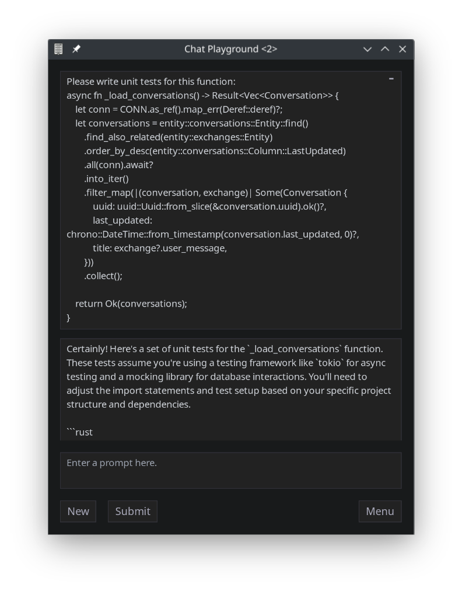
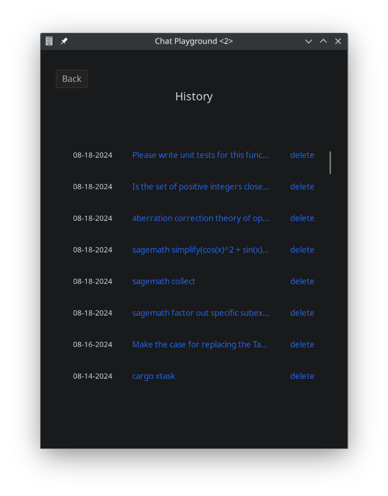
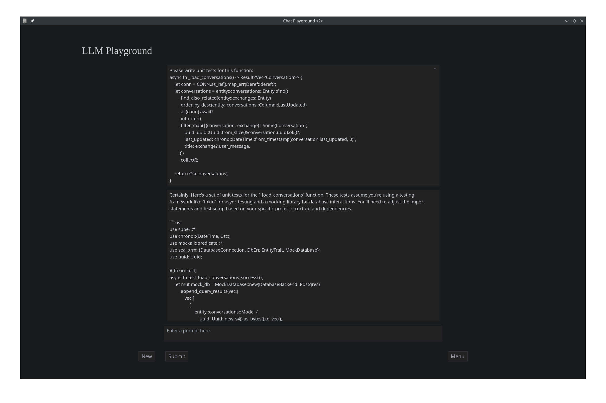

# LLM Playground

Native desktop app for OpenAI, Anthropic, and Google LLMs written in Rust. Create an API key in the OpenAI or Anthropic playground or https://aistudio.google.com/app/apikey and add it in the settings menu. Conversation history is stored in a local SQLite database. OpenAI compatible providers like OpenRouter and Ollama are accessible with the base url option.

## Showcase

  
  

### Maximized

## Installation
- `cargo install cargo-tauri`
- `cargo tauri build`
- MacOS: drag ./target/release/bundle/macos/llm-playground.app into the Applications folder
- Linux:
  - `mkdir -p ~/.local/bin`
  - `cp target/release/llm-playground ~/.local/bin`
  - `mkdir -p ~/.local/share/applications && mkdir -p ~/.local/share/icons`
  - `cp ./bundle/share/applications/llm-playground.desktop ~/.local/share/applications`
  - `cp ./bundle/share/icons/llm-playground.ico ~/.local/share/icons`